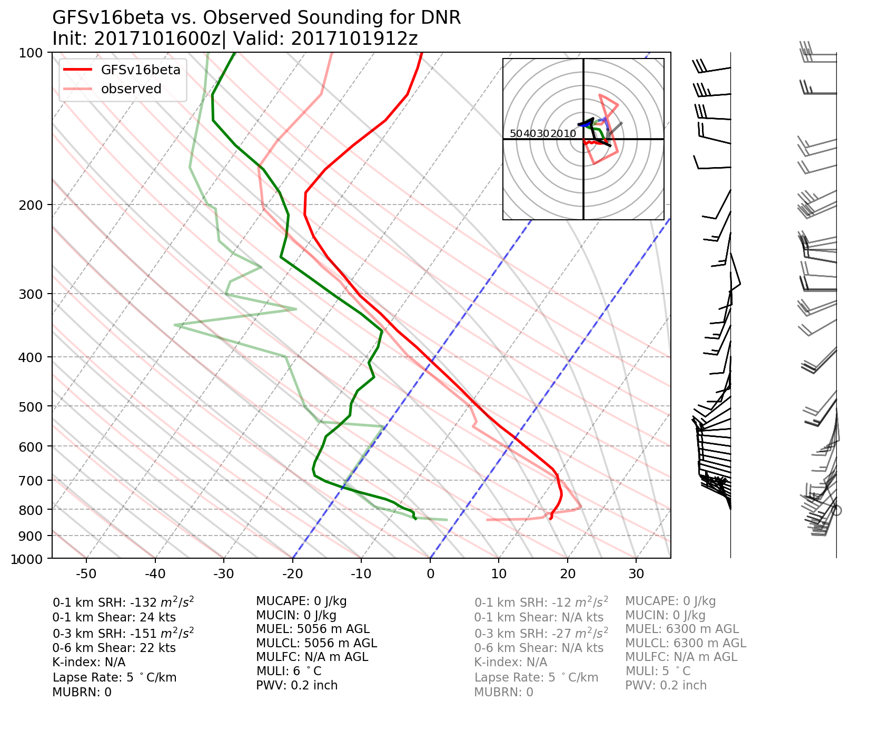
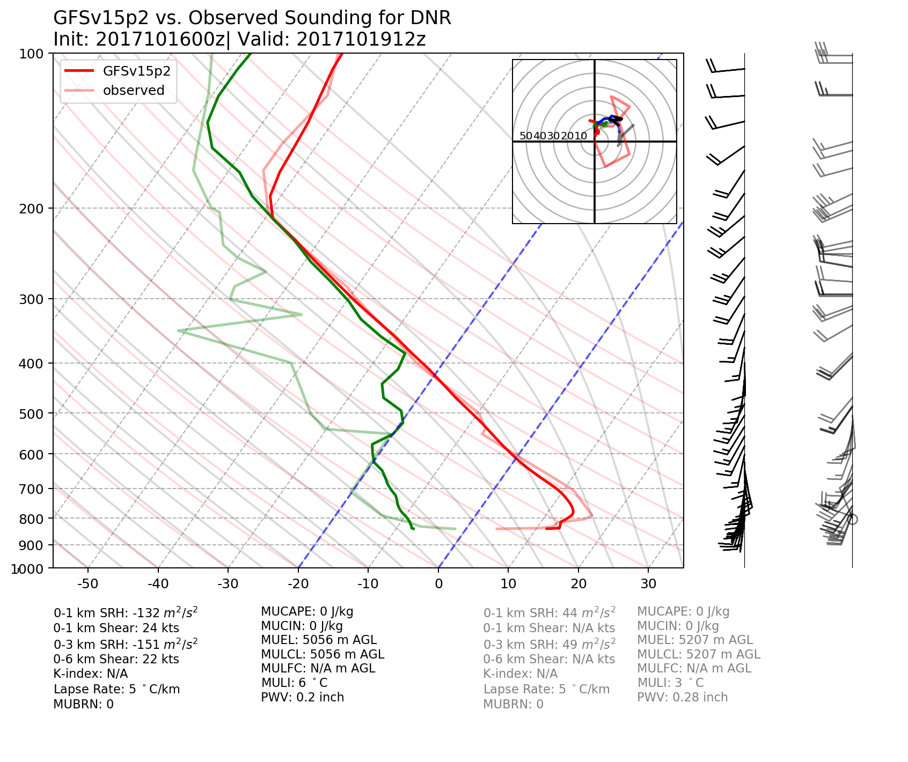

.. BarryCase documentation master file, created by
   sphinx-quickstart on Mon Jul  6 13:31:15 2020.
   You can adapt this file completely to your liking, but it should at least
   contain the root `toctree` directive.

2017 Denver Inversion
=====================================
  
..............................
Model Configuration and Datasets
..............................

The case runs are initialized at 00z Oct 16, 2017 with 168 hours forecasting. The corresponding namelist options that need to be changed are listed below. The app uses ``./xmlchange`` to change the runtime settings. The settings needs to be modified to set up the start date, start time, and run time are listed below.

.. code-block:: bash
 
   ./xmlchange RUN_STARTDATE=2017-10-16,START_TOD=0,STOP_OPTION=nhours,STOP_N=168

Initial condition (IC)  files are created from GFS reanalysis dataset in nemsio format. These files should be 
put in the /run/INPUT directory.

:download:`Initial condition files <https://domain.invalid/>`

Sounding profiles can be downloaded from the `University of Wyoming <http://weather.uwyo.edu/upperair/sounding.html>`_.

..............
Case Results
..............

======================================================
Skew-T Log-P Plot
======================================================

:download:`Source script <../script/hurrican_track_intensity.py>`

+---------+---------+
| |logo1| | |logo2| |
+---------+---------+
