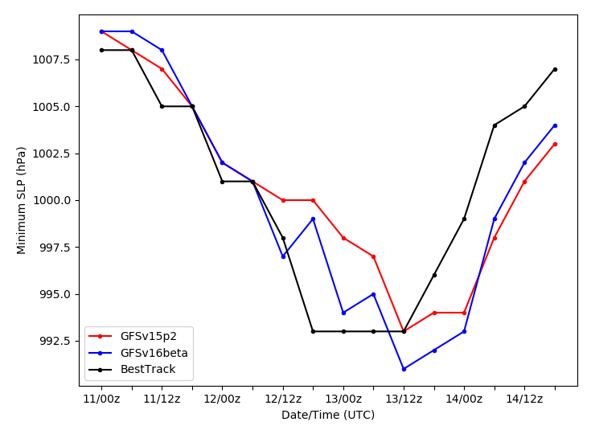

.. BarryCase documentation master file, created by
   sphinx-quickstart on Mon Jul  6 13:31:15 2020.
   You can adapt this file completely to your liking, but it should at least
   contain the root `toctree` directive.

2019 Hurricane Barry
=====================================

Hurricane Barry made landfall in Louisiana on July 11, 2019. The peak wind speed and minimum pressure reached 72 mph and  992 hPa, respectively during the storm. 

...........
Namelist,Datasets and Scripts
...........
===================
Namelist
===================
The UFS Medium-Range (MR) Weather Application (App) is used to prepare initial conditions, compile and run the UFS model, and post process the raw model outputs. Two model configuration compsets (GFSv15p2 and GFSv16beta) are tested using the C768 (~13km) spatial resolution with 64 vertical levels (default).

The case runs are initialized at 00z Jul 11, 2019 with 168 hours forecasting. The corresponding namelist options that need to be changed are listed below.

.. table:: Table  Namelist options
 :align: center

 +---------------+-------------+
 | Options       | Value       |
 +===============+=============+
 | RUN_STARTDATE | 2019-07-11  |
 +---------------+-------------+
 | START_TOD     | 0           |
 +---------------+-------------+
 | STOP_OPTION   | 168         |
 +---------------+-------------+
 | STOP_N.       | nhours      |
 +---------------+-------------+

====================================
Datasets
====================================
Initial condition (IC)  files are created from GFS reanalysis dataset in nemsio format. These files should be put in the /run/INPUT directory.

* `Download the 2019 July Hurricane Barry case initial condition files <https://domain.invalid/>`_

The Stand-alone Geophysical Fluid Dynamics Laboratory(GFDL) Vortex Tracker is a tool to estimate hurricane tracks and intensities. The BestTrack dataset provides the ‘truth’ data for hurricane evolution.

* `Dowload the 2019 July Hurricane Barry Best Track data <https://domain.invalid/>`_ 

====================================
Scripts
====================================
Below are example post-processing scripts used to do the plots.

* `Dowload the example script for hurricane tracks and intensities <https://domain.invalid/>`_ 
* `Dowload the example script for time series of maximum wind speed and minimum sea level pressure  <https://domain.invalid/>`_ 

..............
Case Results
..............

==============================
Hurricane Track and Intensity
==============================

.. figure:: images/tracker_Barry_ufsv1.png
  :width: 600
  :align: center

====================================
Time Series of Max. WS and Min. MSLP
====================================

+---------+---------+
| |logo1| | |logo2| |
+---------+---------+
