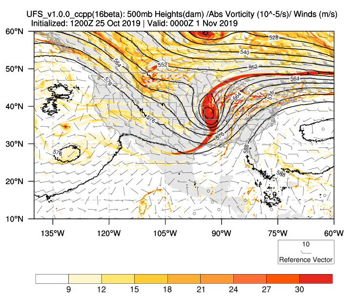
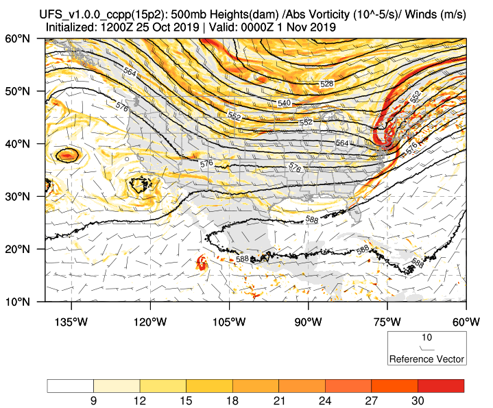
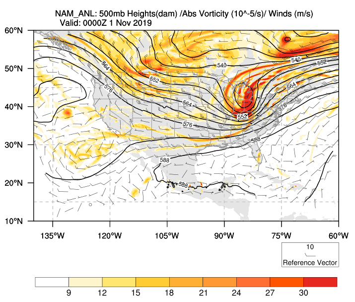
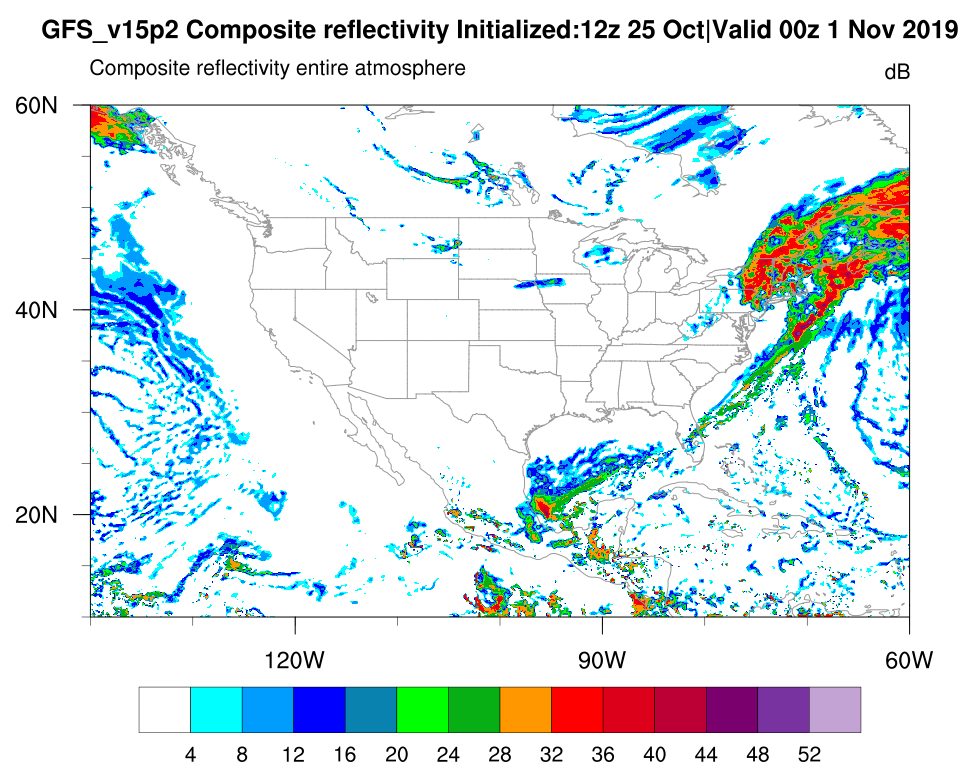
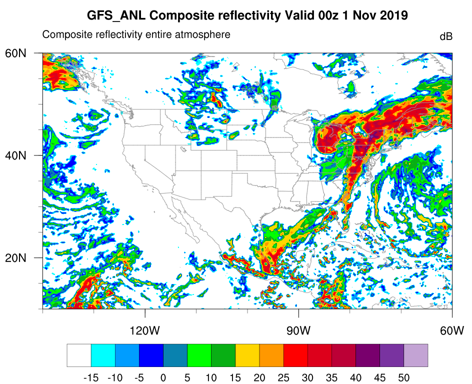
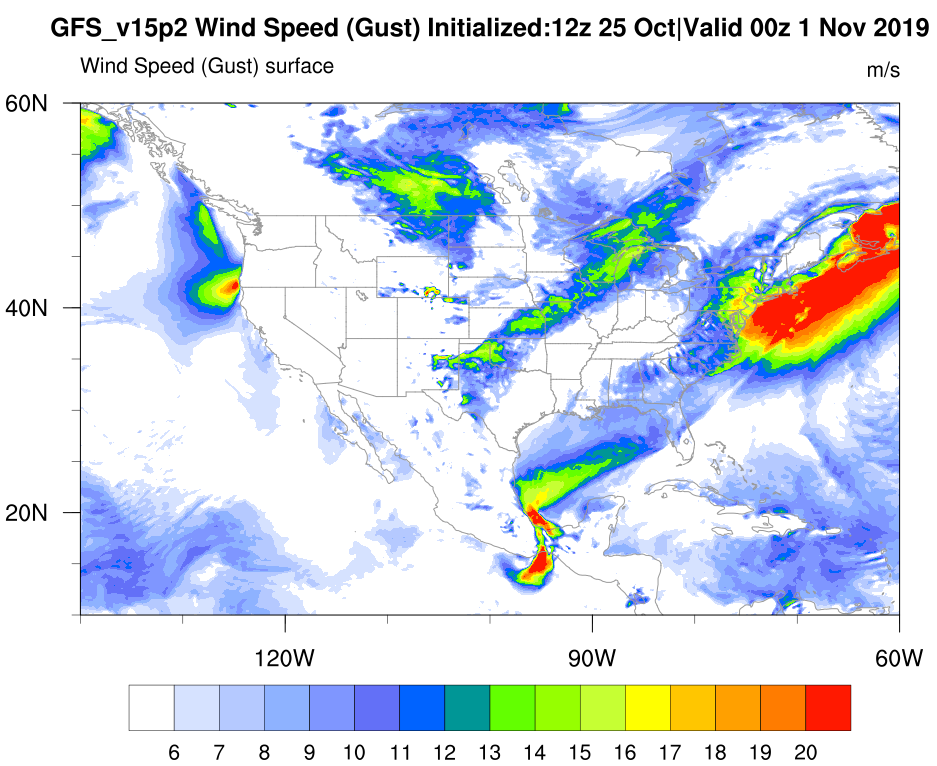
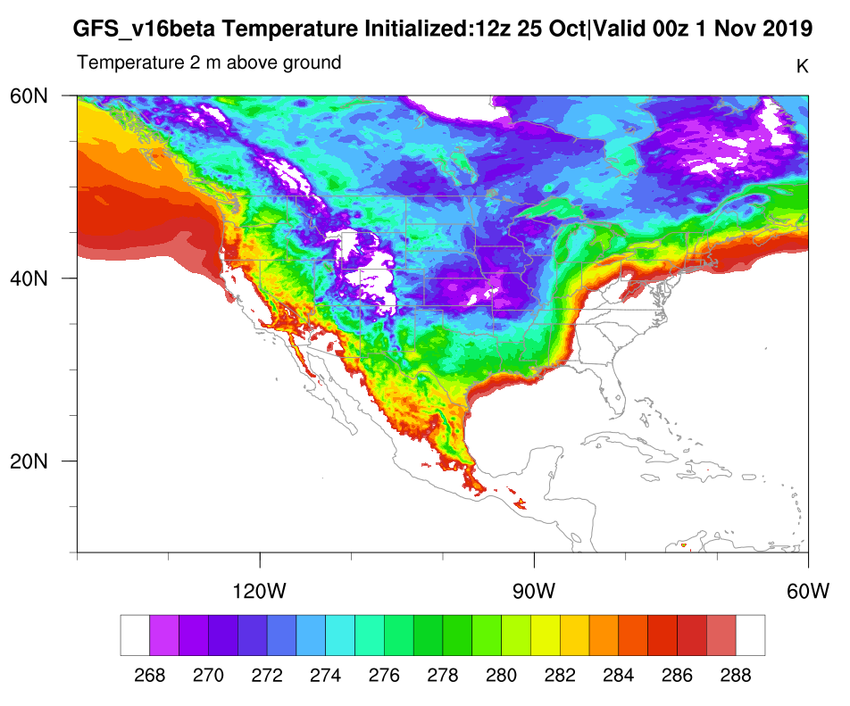
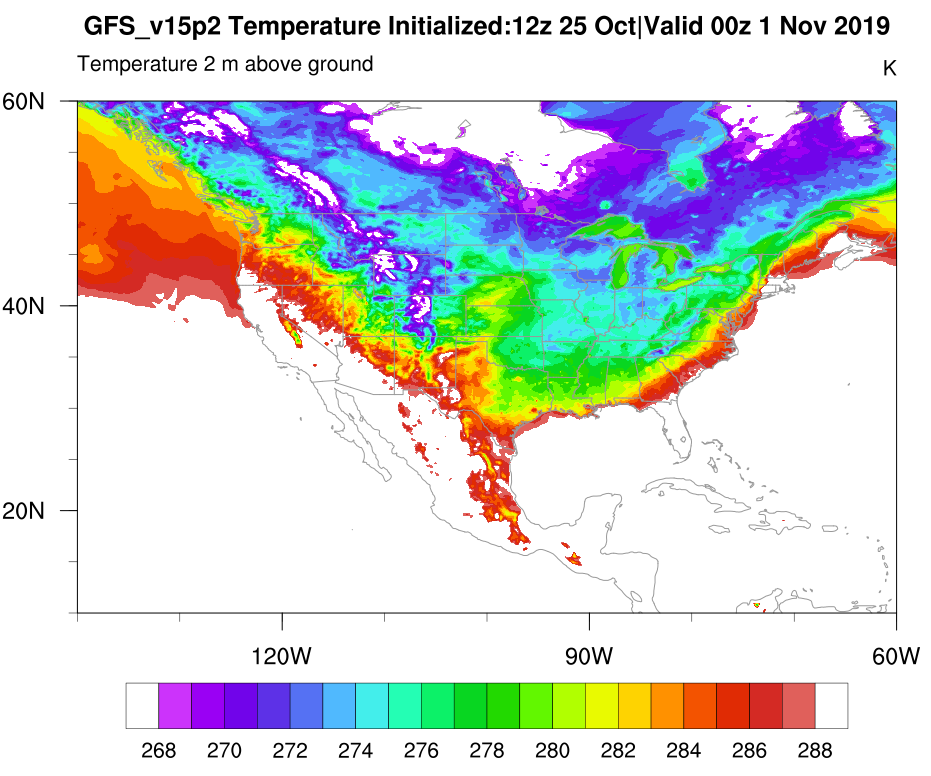
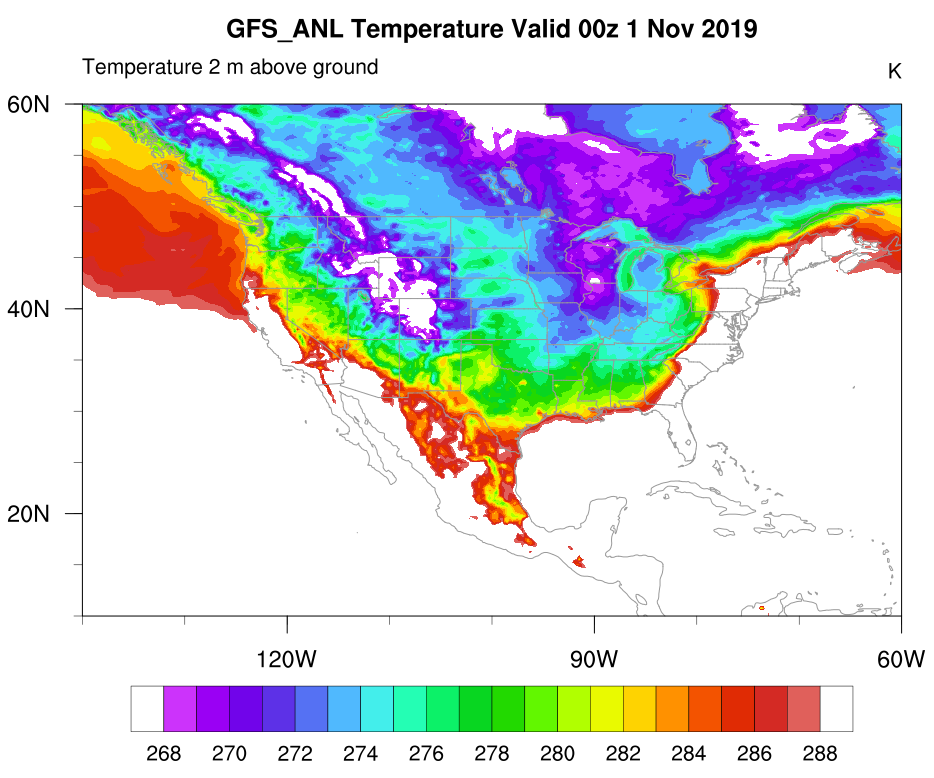

.. BarryCase documentation master file, created by
   sphinx-quickstart on Mon Jul  6 13:31:15 2020.
   You can adapt this file completely to your liking, but it should at least
   contain the root `toctree` directive.

2019 Halloween Storm
=====================================

The 2019 Halloween storm stroke the eastern U.S. cities with wind gusts, thunderstorms, and flash flooding. 

..............................
Namelist, Datasets and Scripts
..............................
===================
Namelist
===================

The case runs are initialized at 12z Oct 25, 2019 with 168 hours forecasting. The corresponding namelist options that need to be changed are listed below.

.. table:: Table Namelist options
 :align: center

 +---------------+-------------+
 | Options       | Value       |
 +===============+=============+
 | RUN_STARTDATE | 2019-10-25  |
 +---------------+-------------+
 | START_TOD     | 43200       |
 +---------------+-------------+
 | STOP_OPTION   | 168         |
 +---------------+-------------+
 | STOP_N.       | nhours      |
 +---------------+-------------+

====================================
Datasets
====================================
Initial condition (IC)  files are created from GFS reanalysis dataset in nemsio format. These files should be put in the /run/INPUT directory.

* `Download the 2019 Halloween Storm case initial condition files <https://domain.invalid/>`_

Reanalysis dataset are used as 'truth' to compare with simulation results.

* `Dowload the GFS Reanalysis datasets <https://www.ncdc.noaa.gov/data-access/model-data/model-datasets/global-forcast-system-gfs>`_ 
* `Dowload the NAM Reanalysis datasets <https://www.ncdc.noaa.gov/data-access/model-data/model-datasets/north-american-mesoscale-forecast-system-nam/>`_ 

====================================
Scripts
====================================
Below are example post-processing scripts used to do the plots.

* `Dowload the example script for 500mb geopotential heigth and absolute voticity map <https://domain.invalid/>`_ 
* `Dowload the example script for composite reflectivity, surface gust, and 2-m temperature  <https://domain.invalid/>`_ 

..............
Case Results
..............

======================================================
500mb Geopotentail Height and Aboslute Vorticity Map
======================================================

+---------+---------+
| |logo1| | |logo2| |
+---------+---------+
| |logo3| |         |
+---------+---------+

====================================
Composite Reflectivity
====================================

.. |logo4| image:: images/GFS16beta_f156_REFC_entireatmosphere.png  
   :width: 600
   :align: middle

+---------+---------+
| |logo4| | |logo5| |
+---------+---------+
| |logo6| |         |
+---------+---------+

====================================
Surface Gust
====================================

.. |logo7| image:: images/GFS16beta_f156_GUST_surface.png  
   :width: 600
   :align: middle

.. |logo9| image:: images/GFSANL_00z1Nov_GUST_surface.png
   :width: 600
   :align: top

+---------+---------+
| |logo7| | |logo8| |
+---------+---------+
| |logo9| |         |
+---------+---------+

====================================
2-m Temperature
====================================

+----------+----------+
| |logo10| | |logo11| |
+----------+----------+
| |logo12| |          |
+----------+----------+
